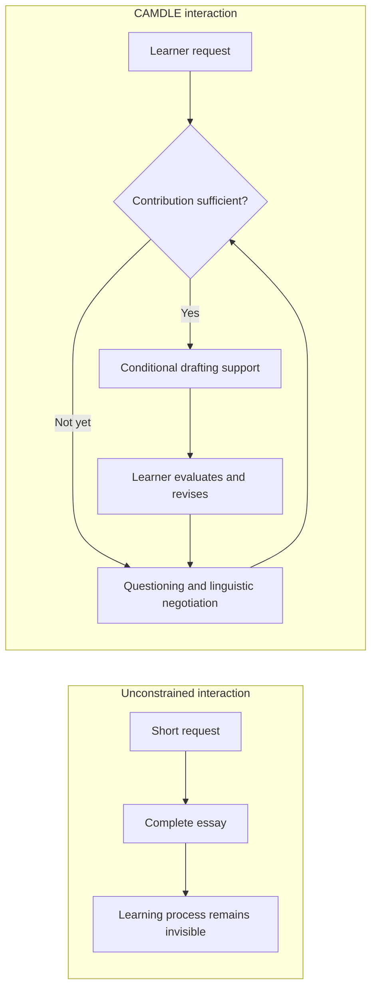
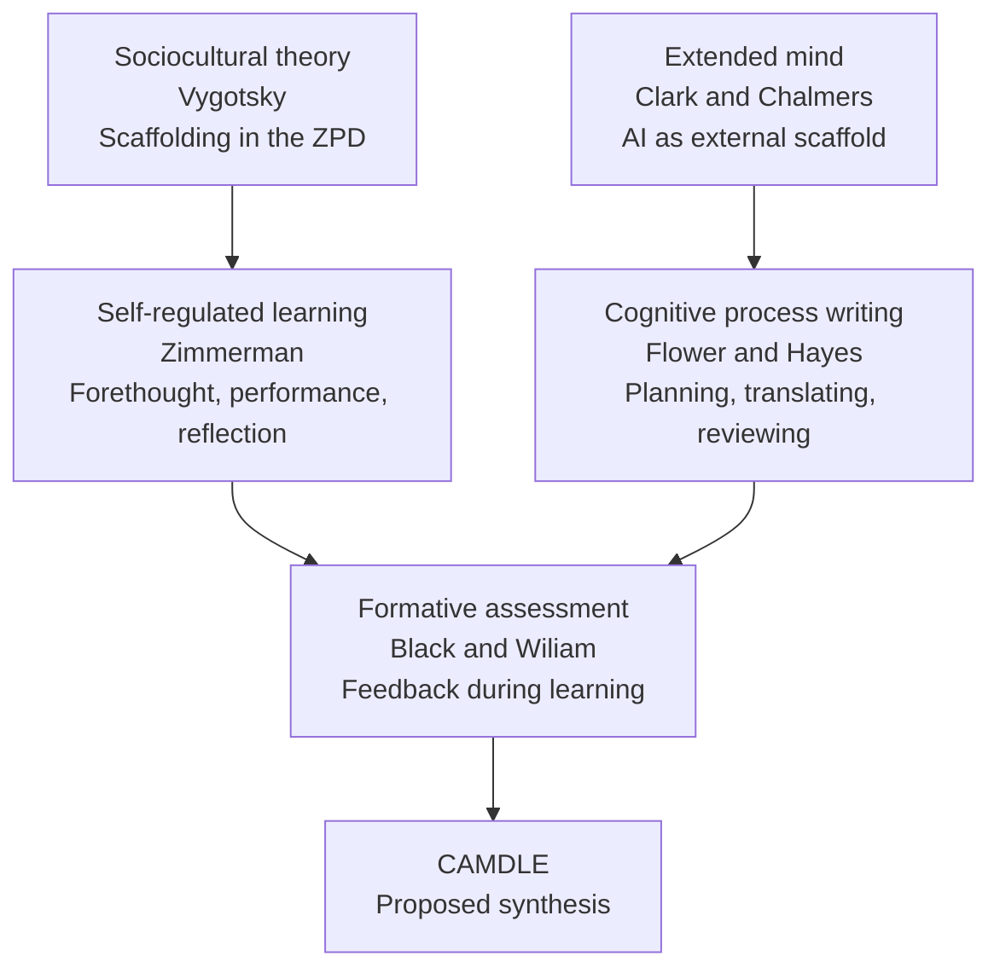
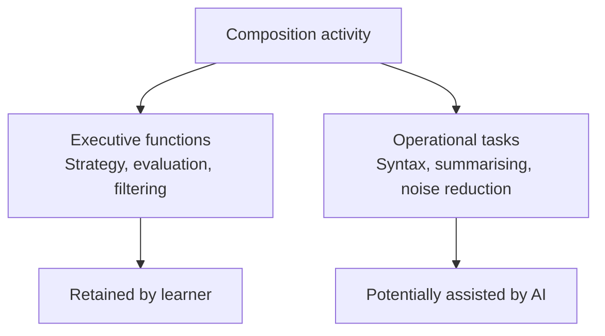

# CAMDLE — constrained AI-mediated dialogic writing (theory, unproven)

`status: draft`. Conceptual framework and research agenda (not an efficacy study).

**Catalog links:** [Threshold calibration](threshold-calibration.en.md) ·
[AI-assisted essay method](../methods/ai-assisted-essay/ai-assisted-essay.en.md)

Translations: none yet — contribute one via PR (see CONTRIBUTING.md).

**Constrained AI-Mediated Dialogic Language Education**  
OpenRigor research and discussion paper · 2 August 2026

## Scope and status

This paper establishes CAMDLE as a conceptual framework and research agenda for
examining how dialogic constraints can mediate writing education with generative
AI. It synthesises established literature, articulates a proposed design,
describes a prototype research method, and identifies hypotheses for empirical
study. OpenRigor has not yet established that CAMDLE improves language
proficiency, writing quality, critical thinking, or academic integrity outcomes.
The claims below are therefore deliberately separated into four categories:

1. **Established literature** — findings or theories reported by cited
   researchers.
2. **Proposed synthesis** — a way of connecting those ideas under the CAMDLE
   name.
3. **Product description** — what the OpenRigor prototype is designed to do.
4. **Open hypothesis** — a claim that requires empirical testing.

The purpose of this paper is to make the proposal inspectable by educators and
researchers, invite criticism, and define a tractable programme of study. Its
status is consequently that of a conceptual framework and research agenda: it
does not present a completed efficacy study or a validated assessment instrument.

## Executive summary

Contemporary generative AI can produce fluent academic prose from a short
request, sharply reducing the effort required to obtain a polished textual
product. This capability sharpens a longstanding problem in writing education:
when the intended learning outcome includes planning, argumentation, language
development, revision, or metacognitive control, the final text is an
incomplete and increasingly ambiguous signal of the process that produced it.

This problem gives contemporary force to Bloom’s (1984) 2-Sigma challenge: how
can education approximate the benefits of expert one-to-one tutoring at scale?
GenAI makes scalable, responsive assistance technically plausible, but it also
sharpens an automation-versus-agency paradox. The same system that can extend
access to expert-like support can also automate the planning, linguistic, and
evaluative activity that writing instruction is meant to develop.

CAMDLE proposes dialogic constraint as a theoretical response to this paradox:
place a conversational AI writing partner inside a process-based environment,
but make substantial drafting assistance conditional on the learner first
contributing ideas, evidence, questions, and language through dialogue. The
constraint is not intended to prove who typed each word. It functions instead
as a pedagogical condition for preserving learner agency: the learner must
negotiate meaning before more powerful assistance becomes available, while the
system retains the responsiveness and scalability that make GenAI educationally
significant.

In this sense, CAMDLE reframes the 2-Sigma challenge for an era of generative
systems. It does not claim to produce two-standard-deviation gains. Instead, it
offers a design hypothesis: scalable dialogic assistance, proportionate
drafting support, and teacher-facing process evidence may bring some benefits
of tutoring into writing education without treating automation as a substitute
for learner judgment.

OpenRigor is a prototype implementation of this idea. It combines a dialogue
panel, a drafting canvas, conditional scaffolding, revision history, and
teacher-facing process signals. The platform is an instrument for research methods, not
evidence that the proposed mechanism works.

The central research question is **threshold calibration**:

> What counts as sufficient dialogic contribution to unlock drafting support,
> and how does that threshold vary by task type, proficiency level, language
> background, and learner strategy?

That question is tracked in the catalog as [Threshold calibration — what counts
as sufficient dialogic contribution?](threshold-calibration.en.md).

This question is narrower and more useful than asking whether “AI in
education” is good or bad. A threshold that is too permissive becomes an
ordinary answer engine. A threshold that is too strict creates frustration,
inequity, and circumvention. The educational value of the design depends on
what learners do before, during, and after the unlock.

## 1. The problem: product-based writing under ubiquitous GenAI

Writing assessment traditionally treats the submitted text as a proxy for
planning, reasoning, language proficiency, and authorship. That proxy was
always imperfect, but generative systems have changed the cost of producing
fluent text. Recent reviews describe benefits in fluency, cohesion,
organisation, vocabulary, and feedback, alongside concerns about over-reliance,
hallucination, bias, diminished metacognitive engagement, and unequal access
([Aljuaid, 2024](https://doi.org/10.24093/awej/ChatGPT.2);
[Urzúa et al., 2025](https://doi.org/10.3390/educsci15101396);
[Sanz-Tejeda et al., 2026](https://doi.org/10.3389/feduc.2025.1711718)).

The psychometric issue can be stated as construct-irrelevant variance. In a
validity argument, observed performance should support inferences about the
construct the assessment intends to measure; construct-irrelevant variance is
systematic variation in the observed response that comes from other sources
(Messick, 1989). When a learner submits text substantially produced or
transformed by a generative system, the text may reflect the model’s language
production, the learner’s prompting and selection skill, access to the system,
and the conditions of use as well as the learner’s own planning, reasoning, or
language proficiency. If the intended inference concerns independent cognitive
processing or authorship, those influences contaminate the score rather than
simply adding noise. The same AI use could be construct-relevant for an
assessment of AI-mediated composing, but it is construct-irrelevant to an
inference about unaided composing unless that use is explicitly part of the
construct and its conditions are defined.

The implication is not that final texts are worthless. It is that a final text
alone no longer supports the same inferences: it may describe the quality of
the submitted product under particular assistance conditions, but it is a weak
and ambiguous basis for inferring the cognitive process that produced it. An
assessment system should instead make relevant interaction and learning
evidence visible and ask the teacher to interpret it in context.

This paper does not propose surveillance or automated authorship detection.
Keystroke patterns, paste events, focus changes, and interaction counts are
mechanical observations. They may prompt a conversation, but they do not prove
who authored a sentence or whether learning occurred.

## 2. OpenRigor as a research instrument

OpenRigor is a browser-based prototype with two related workspaces:

- **Dialogue panel:** the learner discusses the task with a conversational
  language model, develops ideas, asks for feedback, and negotiates wording.
- **Drafting canvas:** the learner writes, edits, accepts, rejects, and revises
  a document.

The model is constrained from generating a complete assignment or substantial
canvas prose from a single low-effort request. After the learner has supplied
enough relevant contribution, limited co-generation may unlock. This is called
**proportional scaffolding**: the amount of assistance is conditional on the
conceptual and linguistic work already visible in the dialogue.

The prototype also records process context such as dialogue turns, canvas
changes, paste events, session pacing, and scaffold unlocks. It is important to
distinguish two evidentiary layers here. **Keystroke telemetry** is a record of
observable interface events: for example, text insertion or deletion, paste
operations, focus changes, timing, and interaction counts. It can describe
what happened in the browser and when, but it does not directly observe
attention, intention, comprehension, planning, or other cognitive states.
**Cognitive process evidence** is the more contentful, interpretive record of
the learner’s work: explanations of choices, claims and evidence developed in
dialogue, responses to feedback, revisions, and transformations of AI
suggestions. These traces can support an argument about the learner’s reasoning
when read in context, but they remain indirect evidence and require human
interpretation; they are not cognitive measurements simply because they occur
during composing.

OpenRigor therefore isolates the interaction layer, not the learner’s whole
cognitive or technological environment. It makes one defined pathway
observable—the learner’s exchanges with the model, the model’s responses, the
canvas state, and the conditions under which assistance is released—while
leaving off-device activity and unobserved mediation outside its measurement
boundary. The resulting signals are presented as context for human judgment,
not as an “integrity score” or an infallible integrity engine. The platform
cannot detect all off-device or mediated behaviour, including retyping,
dictation, paper notes, or assistance from a second device.

The research boundary is therefore explicit:

> OpenRigor can constrain one interaction pathway and expose some process
> evidence. It cannot establish authorship purity, infer learning automatically,
> or eliminate all forms of circumvention.

The instrument view of this method — what dialogic contribution means as a
measured quantity, what process signals conceptually record, and how evidence
cites method identity and levers — is defined in the
[AI-assisted essay method](../methods/ai-assisted-essay/ai-assisted-essay.en.md).
Shared filing rules are in [shared evidence roles](../governance/evidence-roles.en.md).
The pattern itself (capabilities, versioning, levers) is defined in the knowledge
catalog as [research-method].

## 3. The CAMDLE construct

**Constrained AI-Mediated Dialogic Language Education (CAMDLE)** is the
proposed name for a learning design in which a generative agent is prevented
from independently producing the whole assignment, and drafting support is
released conditionally after learner contribution across successive dialogic
iterations.

The construct has five design commitments:

1. **Dialogic contribution precedes substantial generation.** Learners must
   articulate, question, select, or defend ideas before higher-powered
   assistance becomes available.
2. **The constraint is proportional, not absolute.** Learners may use
   assistance; the design regulates when and how much assistance is available.
3. **The learner remains the executive controller.** The learner evaluates,
   accepts, rejects, and revises AI suggestions.
4. **Process is evidence, not verdict.** Dialogue and revision traces support
   teacher interpretation without pretending to prove authorship.
5. **The threshold is an empirical variable.** It must be calibrated against
   learning, equity, usability, and circumvention outcomes.

CAMDLE is a proposed synthesis. The component theories below are established
research traditions; their particular combination, implementation, and
predicted effects are not established by the existence of those traditions.

### 3.1 From one-shot generation to conditional scaffolding

The architectural distinction is not between “AI” and “no AI.” It is between
unconditional substitution and conditional assistance that requires learner
contribution first.

This distinction is also about the location of cognitive control. Cognitive
Load Theory provides a complementary lens: assistance can reduce extraneous
load created by surface mechanics, such as syntax, formatting, lexical
retrieval, or routine summarising, while leaving the task’s productive
conceptual demands in place. It should not remove the learner’s need to build
and coordinate schemas for argumentation, stance, evidence, audience, and
revision. In writing, these executive decisions determine what the text means
and why it should be organised in a particular way; they are not merely more
difficult versions of proofreading.

Accordingly, CAMDLE treats operational offloading as conditional support for
the execution of a decision the learner has made, not as permission for the
agent to make the decision. A learner might request alternative phrasing after
selecting a claim, or syntax feedback after deciding what a sentence must
assert. The learner must still formulate the position, judge whether the
wording preserves it, and decide whether to accept or revise the suggestion.
The constraint therefore protects executive control while allowing the system
to reduce avoidable mechanical burden. This is a design interpretation of
Cognitive Load Theory, not evidence that every reduction in load improves
learning: removing productive difficulty can also remove opportunities for
schema construction and transfer.

The “not yet” state is not intended as punishment. It is the point at which
the system asks the learner to supply conceptual material, explain a choice,
or respond to feedback before receiving more extensive drafting support.

## 4. The theoretical synthesis

The proposed relationship between the five traditions is shown below. The
arrows describe a conceptual synthesis, not a causal model that has already
been empirically validated.

### 4.1 Sociocultural theory and the Zone of Proximal Development

Vygotsky’s account of mediated development provides a rationale for treating
assistance as contingent on what a learner can currently do with support
(Vygotsky, 1978). In CAMDLE, the dialogue can function as a site of
scaffolding: the agent asks for clarification, reflects an idea, or offers a
partial next step rather than immediately replacing the learner’s activity.

Operationally, the ZPD should be treated here as a task- and time-specific
difference between what the learner can do independently and what the learner
can do with contingent assistance. It is not a latent quantity that can be
read directly from message length, vocabulary, turn count, or an unlock
threshold. A defensible implementation would specify the target task, observe
an initial attempt or explanation, provide the smallest useful prompt or
feedback, and examine whether the learner can perform the next step and
eventually transfer the strategy to a new case. The relevant evidence is
therefore performance under a defined support condition, not the presence of
interaction alone.

When the “more knowledgeable other” is an LLM, the term describes a
functional role in a particular interaction, not a claim that the system is a
person, a teacher, or globally more knowledgeable than the learner. An LLM
may supply examples, linguistic alternatives, questions, or domain-relevant
patterns, but it has no guaranteed pedagogical intention, stable understanding
of the learner, or reliable grasp of the assignment context. It can hallucinate,
misdiagnose a difficulty, reproduce bias, or provide an answer that is too
complete to support the learner’s next act. AI-mediated scaffolding is
therefore limited by the quality of its diagnosis, the fit of its prompt, and
the learner’s ability to evaluate its output; it cannot by itself establish
that the learner was in a ZPD or that development occurred.

This does not prove that a token threshold measures a learner’s Zone of
Proximal Development. It suggests a design question: can adaptive assistance
be made more educationally useful when it responds to learner contribution
rather than only to the requested output?

### 4.2 Extended mind and cognitive offloading

The extended mind thesis treats external artefacts as potential components of
cognitive activity when they are reliably available and actively integrated
into problem solving (Clark & Chalmers, 1998). Cognitive offloading can reduce
burden, but the educational effect depends on what is offloaded and what the
learner continues to control. Risko and Gilbert (2016) describe offloading as a
general strategy for using the environment to reduce cognitive demands.

Cognitive Load Theory sharpens this question by distinguishing between
operational burden and executive work. AI can plausibly reduce extraneous load
when it handles syntax, surface correction, formatting, or routine language
retrieval. It becomes educationally substitutive when it takes over the
executive functions through which the learner selects and warrants an
argument, adopts a stance, anticipates an audience, integrates evidence, or
decides what a revision should accomplish. These functions coordinate the
writing task; they are not disposable “high load” steps that can be removed
without changing what is learned.

The Extended Mind account does not settle this boundary. An external artefact
may become part of a learner’s cognitive system when it is reliably available
and trusted, but an LLM is generative, variable, and opaque rather than a
stable notebook or calculator. Its integration can support thinking, or it can
invite uninspected substitution. The educational question is consequently
not whether the LLM is “inside” or “outside” the mind, but whether the learner
retains control of the executive decisions and uses the output as material for
evaluation and transformation.

CAMDLE therefore distinguishes:

- **Strategic offloading:** AI reduces operational burden such as syntax,
  summarising, or alternative phrasing while the learner retains evaluation,
  positioning, synthesis, and rhetorical decisions.
- **Substitutive offloading:** the learner delegates the core conceptual work
  and accepts fluent output without inspection or transformation.

The distinction is a hypothesis about interaction and learning, not something
that can be inferred reliably from a single metric.

The proposed design keeps friction around executive decisions while allowing
selective assistance with operational burden. In practice, the system would
need to make that division visible: the learner’s claim, stance, reasons, and
revision objective should remain inspectable, while assistance with wording or
surface mechanics can be offered as an option. Even then, the distinction is
not guaranteed by the interface or by a single telemetry signal. Whether
preserving executive control while reducing extraneous load actually improves
learning, equity, and transfer is an empirical question.

### 4.3 Self-regulated learning

Self-regulated learning models describe cycles of forethought, performance, and
self-reflection (Zimmerman, 2000; Zimmerman & Moylan, 2009). CAMDLE maps these
activities across the dialogue and canvas: planning and questioning may occur
in dialogue; composing and revising occur on the canvas; evaluation and
reflection move back across both spaces.

The mapping is not a claim that the interface automatically produces
self-regulation. It is a way to formulate measurable questions about planning,
monitoring, strategy choice, revision, and reflection.

### 4.4 Cognitive process writing

Process models of writing describe composing as recursive activity involving
planning, translating, reviewing, and knowledge transformation rather than a
single linear act of transcription (Flower & Hayes, 1981; Bereiter &
Scardamalia, 1987). A dialogue-plus-canvas environment makes some of these
transitions observable.

The relevant outcome is not “more chat” or “more text.” It is whether the
learner produces better explanations, more deliberate decisions, and more
substantive revision.

### 4.5 Formative assessment

Formative assessment emphasises evidence that is used during learning to adapt
instruction and improve the learner’s next move (Black & Wiliam, 1998).
Generative dialogue can provide immediate feedback, but immediacy alone is not
formative. Feedback must be understood, evaluated, and acted upon by the
learner.

This is why CAMDLE keeps the teacher in the interpretive loop. The system may
organise process evidence; it should not convert uncertain traces into
automated grades or accusations.

A related design problem is Bloom’s (1984) 2-sigma challenge: average students
receiving one-to-one tutoring with mastery-learning techniques outperformed
ordinary classroom peers by about two standard deviations, motivating the
search for scalable methods that approach tutoring’s effect. Several Bloom
alterable variables map onto CAMDLE’s intended interaction pattern—tutorial-
style dialogue, feedback-corrective cycles, time on task, and required
participation—without equating an engagement threshold with mastery learning
(e.g. waiting for ~90% on a knowledge check) or claiming measured 2-sigma
outcomes. Bloom motivates *why* a scalable dialogic method is worth
building; threshold calibration remains the primary empirical question.

## 5. Evidence map: what the literature does and does not establish

| Literature stream | Supports | Does not establish |
| --- | --- | --- |
| Process writing | Writing involves recursive planning, translating, and reviewing | That a chat log is a valid proxy for all composing cognition |
| Formative assessment | Feedback can improve the next learning move | That AI feedback is equivalent to expert teacher feedback |
| Bloom 2-sigma / tutoring | One-to-one tutoring plus mastery techniques can produce large achievement gains; scalable approximations are a long-standing design problem | That GenAI dialogue produces 2-sigma gains, or that an engagement unlock equals mastery learning |
| Self-regulated learning | Planning, monitoring, and reflection are relevant learning processes | That interface activity necessarily represents self-regulation |
| Cognitive offloading | External tools can reduce task burden | That offloading operational writing tasks improves durable learning |
| GenAI writing reviews | AI can support fluency, organisation, feedback, and language development | That unconstrained assistance produces independent proficiency |
| L2 / EAP research | AI use raises questions of voice, critical literacy, linguistic difference, and equity | That detector or telemetry signals are fair across language backgrounds |
| Process-based AI assessment | Dialogue and interaction traces can be analysed as candidate evidence | That any particular trace is a validated measure of learning |
| Design-based research | Iterative deployment can refine tools and context-bound theory | That a prototype deployment generalises without comparative studies |

Recent work makes the proposed research tractable but also sets a high bar.
Critical GAI literacy research with L2 doctoral writers connects AI use with
self-regulation, ethical judgment, prompting, and ownership
([Conceptualising and cultivating Critical GAI Literacy, 2024](https://doi.org/10.1016/j.jslw.2024.101156)).
Studies comparing AI and L2 writing caution against treating machine-like
fluency as a neutral benchmark ([Goulart et al., 2024](https://doi.org/10.1016/j.jslw.2024.101160);
[“More human than human?”, 2024](https://doi.org/10.1515/iral-2024-0196)).
Comparative feedback research suggests benefits for lower-order writing
features, while human-plus-AI feedback may be stronger for organisation and
higher-order development
([The role of generative AI and hybrid feedback, 2025](https://doi.org/10.1080/17501229.2025.2503890)).

Process-assessment studies provide particularly relevant precedents. Evidence-
centred assessment has used interaction data to formulate claims about
human-AI collaborative writing, while acknowledging the limits of available
outcome measures
([Evidence-centered Assessment for Writing with Generative AI](https://doi.org/10.1145/3636555.3636866)).
The DRIVE framework similarly treats interaction quality as a candidate object
of assessment rather than assuming that final output is sufficient
([Assessing students’ DRIVE](https://doi.org/10.1016/j.caeai.2025.100497)).
These studies support investigation of process evidence; they do not validate
OpenRigor’s particular threshold or telemetry model.

### 5.1 Operationalising the threshold without pretending to measure learning

For implementation and empirical study, an unlock policy may combine several
observable signals in a provisional computational heuristic, for example:

$$
E = w_t T + w_c C + w_r R + w_v V
$$

where \(T\) represents relevant turn structure, \(C\) conceptual contribution,
\(R\) response to feedback, and \(V\) vocabulary or language work. The weights
\(w_i\) and threshold \(\tau\) are policy parameters to be empirically
optimised against pre-specified learning, process, usability, and equity
criteria. The model is not a latent-trait psychometric model: \(E\) is not an
estimate of intelligence, proficiency, motivation, authorship, or learning,
and \(T\), \(C\), \(R\), and \(V\) are observable or derived features rather
than indicators that identify an underlying psychological trait. Optimisation
should therefore use pre-registered feature definitions and objectives, with
validation and held-out evaluation where feasible, rather than post hoc
selection of weights to fit the observed sample. A simple decision rule could
be written:

$$
\text{unlock} =
\begin{cases}
1 & \text{if } E \geq \tau \\
0 & \text{if } E < \tau
\end{cases}
$$

The research question is whether any such policy produces better learning and
fairer interaction than plausible alternatives. The system must not describe
\(E\) as an intelligence estimate, authorship probability, language-quality
grade, or validated learning measure.

## 6. Research propositions

The following propositions are deliberately falsifiable. In each case,
“independent variable” identifies the manipulated or policy variable,
“dependent variable” identifies the outcome, and “context/moderators”
identifies conditions under which the association may differ:

**P1 — Threshold calibration.** **Independent variable:** threshold policy,
including candidate values of \(\tau\), feature weights \(w_i\), and fixed
versus adaptive calibration. **Dependent variable:** task progress and the
density of learner-generated explanation, evaluation, and revision before and
after the unlock. **Context/moderators:** task genre and difficulty, baseline
proficiency, prior AI experience, and learner language or accessibility
needs. There may be a range of dialogic contribution levels at which
additional AI drafting support improves progress without reducing those
learner-generated processes.

**P2 — Conditional assistance.** **Independent variable:** scaffolding
condition—unconstrained AI assistance versus assistance conditional on the
dialogic threshold. **Dependent variable:** metacognitive explanation
density, operationalised as the proportion of eligible learner turns or
episodes containing an explanation, question, justification, evaluation, or
revision. **Context/moderators:** task and proficiency, with threshold
strictness, interface usability, and prior AI experience treated as potential
moderators. Conditional assistance may increase learner-generated process
evidence relative to unconstrained assistance.

**P3 — Learning transfer.** **Independent variable:** assistance condition
and resulting level of AI drafting support during the supported task.
**Dependent variable:** performance on independent transfer outcomes,
including unassisted writing, delayed writing, explanation, and revision
tasks; the supported text is a proximal outcome, not the sole learning
endpoint. **Context/moderators:** baseline proficiency, task and genre
distance between practice and transfer, delay length, and prior AI
experience. Improvement in supported text should not be interpreted as
learning unless it is accompanied by improvement on independent outcomes.

**P4 — Input and output.** **Independent variable:** interaction mode, such
as AI-language exposure, transcription or relay, and learner-generated
production, compared at comparable levels of task time and support.
**Dependent variable:** subsequent learner-generated language production,
retention or uptake of target language, and independent writing performance.
**Context/moderators:** proficiency, L1, task demands, feedback condition,
and the amount and timing of exposure. The relative value of input,
transcription, and learner-generated output remains an empirical comparison,
not a product claim.

**P5 — Equity.** **Independent variable:** threshold policy—one lexical or
turn-volume threshold versus task- and population-calibrated or adaptive
thresholds. **Dependent variable:** unlock rates, time to unlock,
frustration or attrition, and downstream process and transfer outcomes,
reported with uncertainty and not only as aggregate averages.
**Context/moderators:** proficiency, L1 background, disability,
communication style, task, modality, and access conditions. A single
threshold may produce differential burdens or benefits across these groups.

**P6 — Teacher interpretation.** **Independent variable:** the process
evidence available to the teacher—final draft alone versus a contextualised
evidence bundle containing transcript, draft revisions, assignment context,
and student explanation. **Dependent variable:** teacher feedback quality,
assessment calibration or agreement with a pre-specified rubric, quality of
student-teacher discussion, and teacher workload. **Context/moderators:**
teacher experience and training, class size, task and genre, evidence
presentation, and institutional policy. Process evidence is most defensible
when it improves contextualised human interpretation, rather than being used
for an automated authorship or integrity decision.

## 7. Proposed research programme

### 7.1 Primary study: threshold calibration

Begin with a mixed-methods, design-based study in an EAP or L2 academic
writing context. Compare several pre-registered threshold policies, including
an unconstrained-assistance condition where ethically and institutionally
appropriate. The study should measure:

- baseline and post-intervention writing using blinded, calibrated rubrics;
- independent transfer writing without the same scaffold;
- academic language measures appropriate to the population;
- dialogue contribution, revision, and scaffold-use traces;
- student comprehension of feedback and explanation of decisions;
- motivation, perceived agency, workload, and circumvention attempts;
- teacher workload and interpretive consistency.

The primary endpoint should be specified before deployment. Candidate endpoints
include improvement on an independent writing task, quality of learner
explanations, or a composite process-and-outcome measure developed through
evidence-centred design. A higher final essay score alone is insufficient.

The study should be organised as a sequence of bounded micro-iteration cycles
nested within the primary study. In each cycle, the team should version one
threshold or interface policy, state the design rationale and decision criteria,
run a small feasibility deployment, examine mixed evidence, and then retain,
revise, or suspend the policy before the next cycle. This makes DBR a method for
testing the intervention rather than an invitation to tune it informally around
favourable results.

Each cycle should evaluate two linked questions. First, algorithmic efficacy:
does the policy implement its defined contribution criteria reliably, produce
the intended unlock behaviour, and remain robust across tasks and learner
groups? Evidence may include agreement with blinded human coding, false-unlock
and false-block rates, calibration and stability across tasks, and differential
unlock burdens by proficiency, L1 background, disability, accessibility need,
or communication style. Second, pedagogical acceptability: do learners
understand the requirement, experience it as fair and useful, retain agency,
and use the interaction to produce explanations or revisions? The study should
also assess whether teachers can interpret the evidence consistently without
disproportionate workload, surveillance, or pressure to treat telemetry as a
verdict. Short surveys, interviews, observation, teacher calibration exercises,
and documented circumvention or refusal should complement the process and
learning measures. A policy that is technically reliable but pedagogically
unacceptable, or acceptable but unreliable or inequitable, should not be
treated as a successful iteration.

### 7.2 Secondary studies

1. **Input versus output:** compare genuine learner production, reading/listening
   exposure, and transcription/relay patterns without assuming equal benefits.
2. **L2 fairness:** test whether thresholds produce differential unlock rates,
   frustration, or learning outcomes across proficiency and L1 groups.
3. **Teacher use:** study whether process evidence improves feedback quality,
   calibration, and student-teacher conversations without increasing
   surveillance or workload.
4. **Mechanism:** examine whether dialogue improves planning, vocabulary,
   evaluation, revision, or metacognitive explanation.
5. **Usability and circumvention:** document when constraint creates productive
   effort and when it simply creates friction that learners route around.

### 7.3 Why design-based research fits

Design-based research connects practical intervention design with iterative
theory refinement in authentic settings (The Design-Based Research Collective,
2003). It is suitable for early CAMDLE work because the threshold, interface,
teacher practice, and research measures cannot be separated cleanly at the
prototype stage.

The relevant unit of inquiry is therefore a micro-iteration: a design
hypothesis is made explicit, a bounded version of the intervention is deployed,
algorithmic efficacy and pedagogical acceptability are assessed together, and
the next design decision is justified from both quantitative and qualitative
evidence. Algorithmic results can show whether a policy behaves as specified;
learner and teacher evidence can show whether that behaviour supports the
intended learning activity, imposes unequal burdens, or is routed around.
Comparing these forms of evidence prevents the programme from optimising for
unlock rates, turn counts, or apparent engagement alone. The accumulated cycles
can refine context-bound theory about when conditional assistance supports
learner contribution, while later or held-out comparisons test whether the
refined design has effects beyond the immediate prototype setting.

DBR does not remove the need for comparison groups, transparent measures,
ethics review, or pre-specified analyses. Each cycle should state what changed,
what evidence was collected, what alternative explanations remain, and which
design claims were weakened or strengthened. The protocol should distinguish
exploratory revisions made between cycles from confirmatory tests of a frozen
policy, and should preserve versioned logs of thresholds, prompts, feature
definitions, and decision rules so that post hoc optimisation is visible.

### 7.4 Candidate comparison matrix

| Condition | AI access | Dialogue requirement | Drafting support | Main purpose |
| --- | --- | --- | --- | --- |
| Independent writing | None or ordinary classroom tools | Not applicable | None | Estimate baseline writing and transfer |
| Unconstrained AI | Open conversational AI | None | On request | Estimate substitution and convenience effects |
| Fixed threshold | OpenRigor | Same threshold for all learners | Conditional | Test feasibility of a simple policy |
| Adaptive threshold | OpenRigor | Calibrated by task and learner context | Conditional | Test equity and learning trade-offs |
| Human-plus-AI feedback | AI plus teacher feedback | Structured reflection | Conditional | Examine whether human feedback changes higher-order outcomes |

The matrix is a starting point, not a recommendation to randomise minors into
unapproved conditions. Any comparison must be adapted to the educational
setting, ethics review, consent, and the learning opportunity owed to
participants.

### 7.5 Candidate outcome model

For a pre/post design, a basic change score is:

$$
\Delta P_i = P_{i,\mathrm{post}} - P_{i,\mathrm{pre}}
$$

where \(P\) is a pre-specified proficiency or writing-process outcome for
learner \(i\). A stronger design compares \(\Delta P\) across conditions while
adjusting only for pre-registered covariates such as baseline proficiency,
task, and prior AI experience. The primary endpoint should be independent
transfer, not the quality of a text produced with unequal amounts of AI help.

## 8. Ethics, limitations, and governance

Research with student dialogue, writing, and interaction traces requires
particular care across jurisdictions. A South African deployment involving
minors should treat POPIA as the primary local example, within a broader
framework that may also include the GDPR where its territorial or personal-data
rules apply, FERPA where U.S. educational records are covered, and the
requirements of the relevant institutional IRB or research ethics committee.
The applicable duties will depend on the jurisdiction, the institution’s
controller or processor role, the participant’s age, and whether the data are
used for education, research, or both.

Across these frameworks, interaction telemetry and dialogue should be treated
as potentially identifiable personal or educational data rather than as neutral
system diagnostics. The protocol should establish a lawful and ethically
reviewed basis for collection; clear notice; parental or guardian permission
and student assent where required; voluntary participation and a meaningful
non-penalised alternative; data minimisation and purpose limitation; retention,
access, correction, deletion or withdrawal procedures where applicable; secure
storage; de-identification or pseudonymisation; controlled access and sharing;
cross-border transfer arrangements; and incident response. GDPR-related
reviews should address data-subject rights, protections for minors, and
profiling or automated decision-making where applicable. FERPA-related
reviews should address education-record status, institutional access and
disclosure controls, and parent or eligible-student rights. POPIA-related
reviews should address responsible-party accountability, lawful processing,
purpose specification, security safeguards, and participation rights. IRB or
ethics review should additionally assess the necessity and proportionality of
keystroke, focus, clipboard, and conversational data, the risk of chilling
effects or re-identification, the plan for handling disclosures, and whether
students can challenge interpretations. The platform should collect only
signals needed for the research question and should not expose students to
hidden or punitive profiling.

Important limitations include:

- process signals are circumstantial and incomplete;
- a constraint can create frustration, inequity, or strategic gaming;
- dialogue volume is not equivalent to language quality or learning;
- AI responses can hallucinate, reproduce bias, or provide poor feedback;
- teacher interpretation can vary and requires calibration;
- L2 writers should not be judged against monolingual machine fluency;
- novelty effects and instructor enthusiasm may inflate early results;
- a product-developed intervention carries a conflict of interest;
- results from one age group, genre, language, or institution may not generalise.

The responsible claim is therefore modest: CAMDLE offers a testable way to
structure AI-mediated writing and expose more of the interaction for human
interpretation. Whether it improves learning, for whom, and under which
thresholds remains to be established.

## 9. Implications for educators and institutions

For educators, the immediate implication is not to adopt a numerical
engagement score. It is to make the intended learning process explicit:

- define what students must explain, decide, and revise;
- teach students to interrogate and correct AI output;
- assess independent transfer, not only supported products;
- read dialogue and revision evidence in context;
- explain what is collected and why;
- give students a way to challenge or explain process evidence.

For institutions, process-based AI assessment should complement—not replace—
human judgment, assessment design, accessibility support, and clear policy.
Tools should not turn uncertain telemetry into automated misconduct findings.

## 10. Collaboration invitation

OpenRigor is available as a prototype for educators and researchers
who want to investigate constrained AI-mediated writing. Possible
collaborations include:

- a small institutional pilot focused on feasibility and teacher workload;
- a co-designed study of threshold calibration or L2 writing;
- an independent postgraduate project using the platform as an instrument;
- a methodological critique of process evidence and interaction assessment.

Academic collaborators should retain ownership of the research question,
protocol, analysis, and publication decisions. OpenRigor can contribute access
to the prototype, implementation support, and appropriately governed telemetry,
while disclosing its commercial interest in positive findings.

## 11. Conclusion

CAMDLE is a proposal about how to design AI-mediated writing so that the
learner’s contribution remains visible and consequential. Its most valuable
claim is not that a gate automatically creates learning. It is that the gate
creates a manipulable research variable: the amount and kind of contribution
required before drafting assistance becomes available.

That variable can be tested. A credible research programme should be willing to
find that some thresholds do not work, that effects differ across learners,
that human feedback is necessary, or that the constraint creates more
frustration than learning. This document’s purpose is to make those findings
possible—not to pre-announce them.

## References

The list below combines foundational works with recent research identified for
this agenda. It is a working bibliography, not a claim of exhaustive
systematic-review coverage.

- Aljuaid, H. (2024). *The impact of artificial intelligence tools on academic
  writing instruction in higher education: A systematic review*. Arab World
  English Journal. https://doi.org/10.24093/awej/ChatGPT.2
- Bereiter, C., & Scardamalia, M. (1987). *The psychology of written
  composition*. Lawrence Erlbaum Associates.
- Black, P., & Wiliam, D. (1998). Assessment and classroom learning.
  *Assessment in Education: Principles, Policy & Practice, 5*(1), 7–74.
- Bloom, B. S. (1984). The 2 sigma problem: The search for methods of group
  instruction as effective as one-to-one tutoring. *Educational Researcher,
  13*(6), 4–16. https://doi.org/10.3102/0013189X013006004
- Clark, A., & Chalmers, D. (1998). The extended mind. *Analysis, 58*(1),
  7–19. https://doi.org/10.1093/analys/58.1.7
- The Design-Based Research Collective. (2003). Design-based research: An
  emerging paradigm for educational inquiry. *Educational Researcher, 32*(1),
  5–8.
- Fan, Y., Tang, L., Le, H., et al. (2024). Beware of metacognitive laziness:
  Effects of generative artificial intelligence on learning motivation,
  processes, and performance. *British Journal of Educational Technology*.
- Flower, L., & Hayes, J. R. (1981). A cognitive process theory of writing.
  *College Composition and Communication, 32*(4), 365–387.
- Goulart, L., Matte, M. L., Mendoza, A., et al. (2024). AI or student
  writing? Analyzing the situational and linguistic characteristics of
  undergraduate student writing and AI-generated assignments. *Journal of
  Second Language Writing, 66*, 101160.
  https://doi.org/10.1016/j.jslw.2024.101160
- Messick, S. (1989). Validity. In R. L. Linn (Ed.), *Educational measurement*
  (3rd ed., pp. 13–103). Macmillan.
- Risko, E. F., & Gilbert, S. J. (2016). Cognitive offloading. *Trends in
  Cognitive Sciences, 20*(9), 676–688.
  https://doi.org/10.1016/j.tics.2016.07.002
- Sanz-Tejeda, A., Domínguez-Oller, J. C., Baldaquí-Escandell, J. M.,
  Gómez-Díaz, R., & García-Rodríguez, A. (2026). The impact of generative AI
  on academic reading and writing: A synthesis of recent evidence
  (2023–2025). *Frontiers in Education*. https://doi.org/10.3389/feduc.2025.1711718
- Urzúa, C. A. C., Ranjan, R., Saavedra, E. E. M., et al. (2025). Effects of
  AI-assisted feedback via generative chat on academic writing in higher
  education students: A systematic review of the literature. *Education
  Sciences, 15*(10), 1396. https://doi.org/10.3390/educsci15101396
- Vygotsky, L. S. (1978). *Mind in society: The development of higher
  psychological processes*. Harvard University Press.
- Zimmerman, B. J. (2000). Attaining self-regulation: A social cognitive
  perspective. In M. Boekaerts, P. R. Pintrich, & M. Zeidner (Eds.),
  *Handbook of self-regulation* (pp. 13–39). Academic Press.
- Zimmerman, B. J., & Moylan, A. R. (2009). Self-regulation: Where
  metacognition and motivation intersect. In D. J. Hacker, J. Dunlosky, &
  A. C. Graesser (Eds.), *Handbook of metacognition in education*
  (pp. 299–315). Routledge.

### Recent process and L2 writing precedents

- *Assessing students’ DRIVE: A framework to evaluate learning through
  interactions with generative AI*. (2025). *Computers and Education:
  Artificial Intelligence*. https://doi.org/10.1016/j.caeai.2025.100497
- *Conceptualising and cultivating Critical GAI Literacy in doctoral academic
  writing*. (2024). *Journal of Second Language Writing*.
  https://doi.org/10.1016/j.jslw.2024.101156
- *Evidence-centered Assessment for Writing with Generative AI*. (2024).
  Association for Computing Machinery. https://doi.org/10.1145/3636555.3636866
- *Exploring the boundaries of authorship: A comparative analysis of
  AI-generated text and human academic writing in English literature*. (2024).
  *Frontiers in Education*. https://doi.org/10.3389/feduc.2024.1347421
- *More human than human? Differences in lexis and collocation within
  academic essays produced by ChatGPT-3.5 and human L2 writers*. (2024).
  *International Review of Applied Linguistics in Language Teaching*.
  https://doi.org/10.1515/iral-2024-0196
- *The role of generative AI and hybrid feedback in improving L2 writing
  skills: A comparative study*. (2025). https://doi.org/10.1080/17501229.2025.2503890

## Appendix A: Example assignment and interaction

**Assignment:** Write a 700-word essay explaining how the title *Great
Expectations* changes meaning as Pip’s understanding of wealth, class, and
loyalty develops.

**Low-contribution request**

> **Student:** Write my essay about the title of *Great Expectations*.
>
> **System response:** I can help you develop it, but first explain what Pip
> expects at the beginning of the novel and what changes by the end.

**Contribution before unlock**

> **Student:** At first Pip expects to become a gentleman because Estella makes
> him ashamed of being a blacksmith. He thinks money will make him worthy of
> Estella. Later, when he learns Magwitch is the benefactor, his expectation
> that wealth will make him respectable collapses. He has to learn that Joe’s
> loyalty matters more than status.

This interaction is evidence that the learner articulated a possible argument.
It is not proof that the learner wrote every later sentence or that the
interaction caused language development. A teacher would still need to inspect
the learner’s explanations, revisions, and independent transfer work.

## Appendix B: Process evidence interpretation guide

| Observation | Permissible interpretation | Impermissible conclusion |
| --- | --- | --- |
| Large paste event | A block of text entered at once; discuss its source and role | The student cheated |
| Many short dialogue turns | The learner engaged in repeated interaction | The learner learned |
| Few turns before unlock | The threshold policy may be too permissive or the contribution may be concise | The learner was disengaged |
| Frequent revision | The draft changed repeatedly | The learner authored every word |
| Long pause | The learner was inactive in the interface | The learner was off-task |
| Tab or focus change | The browser lost focus | The learner used an unauthorised generator |

Process signals are prompts for professional judgment. They should be read
with the assignment, transcript, draft history, student explanation, and
institutional policy.

## Appendix C: Publication and conflict-of-interest statement

This document is produced by the developer of OpenRigor and therefore has a
commercial interest in the platform being useful. The document reports no
original participant study and makes no efficacy claim. Independent
collaborators should control study design, analysis, interpretation, and
publication decisions. Any future empirical paper should disclose the
platform’s role, data access arrangements, funding, and author affiliations.

## Appendix D: Terminology

- **CAMDLE:** Constrained AI-Mediated Dialogic Language Education, the proposed
  learning-design construct.
- **Dialogue panel:** The conversational workspace where the learner develops
  and discusses ideas with the AI.
- **Drafting canvas:** The document workspace where the learner composes and
  revises.
- **Proportional scaffolding:** Conditional release of drafting assistance after
  learner contribution.
- **Engagement threshold:** A design parameter governing the unlock decision;
  not a validated measure of learning or authorship.
- **Process evidence:** Observable interaction context used by teachers as one
  source of judgment.
- **Strategic offloading:** Delegating operational work while retaining
  executive evaluation and direction.
- **Substitutive offloading:** Delegating conceptual work and accepting output
  without meaningful evaluation or transformation.

[research-method]: https://github.com/openrigor/knowledge/blob/main/concepts/research-method.en.md
